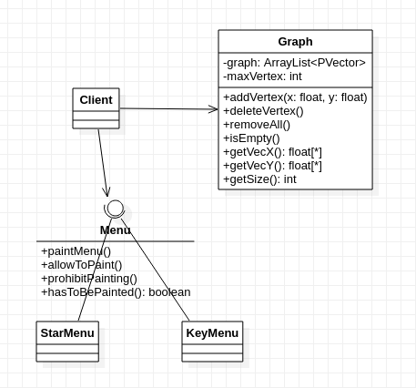

# Shaders-Processing!


## Autor
Miguel Ángel Medina Ramírez <br>
Correo: miguel.medina108@alu.ulpgc.es

## Indice
1. [Introducción](#introducción)
2. [Dependencias](#dependencias)
3. [Implementación](#implementación) <br>
    3.1 [Diagrama](#diagrama)<br>
    3.2 [Paso de parámetros](#paso-de-parametros)<br>
    3.3 [Creación de Grafos](#creación-de-grafos)<br>
    3.4 [Movimiento](#movimiento)<br>
4. [Eventos](#eventos)
5. [Bibliografía](#bibliografía)

## Introducción

Para esta práctica se ha hecho una integración **GPU-CPU** mediantes shaders de fragmentos y processing. Consiste en representar grafos completos con estructuras simples como líneas y circulos, y darle un movimiento a sus vertices y aristas para observar como se mueve en la pantalla. El objetivo es que el usuario mediante un grafo completo llege a hacer algún tipo de patrón y observe su movimiento.

## Dependencias

Para poder ejecutar y probar la práctica solamente se necesita clonar este repositorio y tener instalado processing.

## Implementación

Para poder hacer un mejor uso de la potencia de la GPU (shaders) se ha dejado a esta los cálculos relativos a la representación de gráficos a a los moviemntos, la CPU (processing) se encarga de la abstracción de la representación y el paso de información.

### Diagrama

*El siguiente diagrama UML solo muestra la relación de clases dentro de processing, con respecto a los shaders y al lenguaje GLSL su implementación está en un **paradigma** imperativo*

<p align="center">
  
</p>
<p align="center">
  Figura 1: Diagrama UML
</p>
<br>

### Paso de parámetros

Para hacer los cálculos con la GPU se necesita una serie de variables que processing debe pasar al shader:

```java

void defineShader(){
  shader(sh);
  sh.set("u_mouse",float(mouseX),height-float(mouseY));
  sh.set("u_resolution",float(width),float(height));
  sh.set("u_vecX", graph.getVecX());
  sh.set("u_vecY", graph.getVecY());
  sh.set("u_size", graph.getSize());
  sh.set("u_time",millis()/toSeconds);
  sh.set("u_paintPoint",paintPoint);
  sh.set("u_typeSpeed",typeSpeed);
  rect(0,0,width,height);
}

```

* *u_mouse*: es la posición del ratón en la pantalla.

* *u_resolution*: es el tamaño de la pantalla.

* *u_vecX*: son las posiciones en el eje X de los nodos del grafo.

* *u_vecY*: son las posiciones en el eje Y de los nodos del grafo.

* *u_size*: la cantidad de nodos.

* *u_time*: el tiempo que ha pasa entre un refreso de pantalla y otro, la variable *toSeconds* nos permitirá controlar la velocidad a la que se mueve el grafo.

* *u_paintPoint*: el punto en X e Y de posible nodos que se vaya a colocar.

* *u_typeSpeed*: el tipo de velociad ha aplicar.

Asimismo, se dispone de una serie de constantes en GLSL:

```C++
#define RADIUS    0.0005
#define THICKNESS 0.001
#define LEN       128
```

* *RADIUS*: define el radio de los circulos(nodos).
* *THICKNESS*: define el grosor de las líneas.
* *LEN*: el tamaño máximo de un posible grafo.Como el paso de estructuras dinámicas en GLSL no es posible, se ha defino del tamaño máximo de un grafo a 128 nodos, no obstante dependiendo de la GPU que se tenga, una cantidad de nodos cercana a ese valor se puede llegar a notar en el rendimiento a la hora de aplicar velocidad.

### Creación de Grafos

La clase Graph actua como representación abstracta de un grafo guardondo solo sus nodos, se pasará a GLSL las posiciones de estos y mediante el siguiente algoritmo se pude representasr un grafo complejos sin muchos recursos.

```C++

void drawGraph(vec2 st){
    for(int index = 0; index < u_size; index++){
        vec2 speed = getSpeed(u_time);
        drawCircle(st - (calculePosition(vec2(u_vecX[index], u_vecY[index]), speed)));
        for(int secondIndex = index + 1; secondIndex < u_size; secondIndex++){
            gl_FragColor += drawLine(
                calculePosition(vec2(u_vecX[index],       u_vecY[index]),       speed),
                calculePosition(vec2(u_vecX[secondIndex], u_vecY[secondIndex]), speed),
                st) * vec4(colorA,1.0);
        }
    }

}
```

Como GLSL no nos ofrece ninguna privitiva de dibujo, hay que implementarla. En este caso solo hace falta hacer líneas y circulos, que se pude lograr interpolando con la función *smoothstep*:

```C++
float circle(in vec2 _st, in float _radius){
    vec2 dist = _st;
	return 1.-smoothstep(_radius-(_radius*0.01),
                         _radius+(_radius*0.01),
                         dot(dist,dist)*4.0);
}

void drawCircle(vec2 pos){
    vec3 color    = vec3(circle(pos,RADIUS));
    gl_FragColor += vec4( color, 1.0 ) * vec4(colorB,1.0);
} 


float drawLine(vec2 p1, vec2 p2, vec2 st) {

  float a = abs(distance(p1, st));
  float b = abs(distance(p2, st));
  float c = abs(distance(p1, p2));

  if ( a >= c || b >=  c ) return 0.0;

  float p = (a + b + c) * 0.5;

  float h = 2. / c * sqrt( p * ( p - a) * ( p - b) * ( p - c));

  return mix(1.0, 0.0, smoothstep(0.5 * THICKNESS, 1.5 * THICKNESS, h));
}
```

### Movimiento

## Eventos

## Bibliografía

* [Guion de prácticas](https://cv-aep.ulpgc.es/cv/ulpgctp20/pluginfile.php/126724/mod_resource/content/22/CIU_Pr_cticas.pdf)
* [processing.org](https://processing.org/)
* [El lenguaje GLSL](https://en.wikipedia.org/wiki/OpenGL_Shading_Language)
* [GLSL Noise Algorithms](https://gist.github.com/patriciogonzalezvivo/670c22f3966e662d2f83)
* [The Book of Shaders](https://thebookofshaders.com/?lan=es)