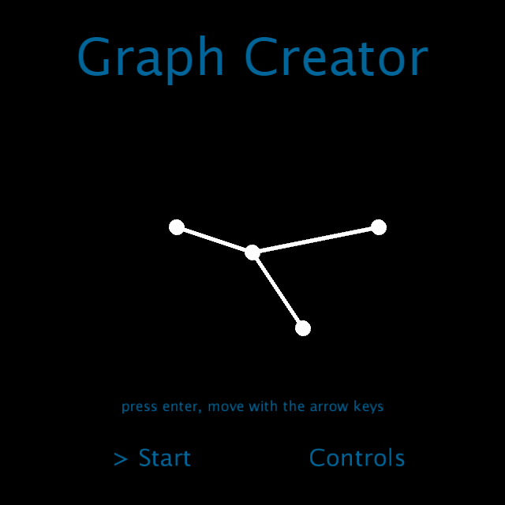

# Shaders-Processing


## Autor
Miguel Ángel Medina Ramírez <br>
Correo: miguel.medina108@alu.ulpgc.es

## Indice
1. [Introducción](#introducción)
2. [Demostración](#demostración)
3. [Dependencias](#dependencias)
4. [Implementación](#implementación) <br>
    4.1 [Diagrama](#diagrama)<br>
    4.2 [Paso de parámetros](#paso-de-parametros)<br>
    4.3 [Creación de Grafos](#creación-de-grafos)<br>
    4.4 [Movimiento](#movimiento)<br>
5. [Eventos](#eventos)
6. [Bibliografía](#bibliografía)

## Introducción

Para esta práctica se ha hecho una integración **GPU-CPU** mediantes shaders de fragmentos y processing. Consiste en representar grafos completos con estructuras simples como líneas y círculos, y darle un movimiento a sus vértices y aristas para observar cómo se mueve en la pantalla. El objetivo es que el usuario mediante un grafo completo llegue a hacer algún tipo de patrón y observe su movimiento.

## Demostración
<p align="center"> 
   </img>
   <p align="center">Figura 1: Gif de demostración</p>
</p>


## Dependencias

Para poder ejecutar y probar la práctica se necesita clonar este repositorio y tener instalado processing.

- La librería **GifAnimation** para poder reproducir y guardar gifs. Como esta librería no forma parte necesaria para la correcta implementación de la práctica, en el código toda la lógica relacionada con ella se encuentra comentada, además de que afecta al rendimiento de la aplicación.En este [enlace](https://github.com/extrapixel/gif-animation) se encuentra la forma de instalarla.
 
## Implementación

Para poder hacer un mejor uso de la potencia de la GPU se ha dejado a esta los cálculos relativos a la representación de gráficos y los movimientos, la CPU se encargará de la abstracción de la representación y el paso de información.

### Diagrama

*El siguiente diagrama UML solo muestra la relación de clases dentro de processing, con respecto a los shaders y al lenguaje GLSL su implementación está en un **paradigma** imperativo*

<p align="center">
  
</p>
<p align="center">
  Figura 2: Diagrama UML
</p>
<br>

### Paso de parámetros

Para hacer los cálculos con la GPU se necesita una serie de variables que processing debe pasar al shader:

```java

void defineShader(){
  shader(sh);
  sh.set("u_mouse",float(mouseX),height-float(mouseY));
  sh.set("u_resolution",float(width),float(height));
  sh.set("u_vecX", graph.getVecX());
  sh.set("u_vecY", graph.getVecY());
  sh.set("u_size", graph.getSize());
  sh.set("u_time",millis()/toSeconds);
  sh.set("u_paintPoint",paintPoint);
  sh.set("u_typeSpeed",typeSpeed);
  rect(0,0,width,height);
}

```

* *u_mouse*: es la posición del ratón en la pantalla.

* *u_resolution*: es el tamaño de la pantalla.

* *u_vecX*: son las posiciones en el eje X de los nodos del grafo.

* *u_vecY*: son las posiciones en el eje Y de los nodos del grafo.

* *u_size*: la cantidad de nodos.

* *u_time*: el tiempo que ha pasado entre un refresco de pantalla y otro, la variable *toSeconds* nos permitirá controlar la velocidad a la que se mueve el grafo.

* *u_paintPoint*: el punto en X e Y de posibles nodos que se vayan a colocar.

* *u_typeSpeed*: el tipo de velocidad ha aplicar.

Asimismo, se dispone de una serie de constantes en GLSL:

```c++
#define RADIUS    0.0005
#define THICKNESS 0.001
#define LEN       128
```

* *RADIUS*: define el radio de los círculos(nodos).
* *THICKNESS*: define el grosor de las líneas.
* *LEN*: el tamaño máximo de un posible grafo.Como el paso de estructuras dinámicas en GLSL no es posible, se ha defino del tamaño máximo de un grafo a 128 nodos, no obstante dependiendo de la GPU que se tenga, una cantidad de nodos cercana a ese valor se puede llegar a notar en el rendimiento a la hora de aplicar una velocidad.

### Creación de Grafos

La clase Graph actúa como representación abstracta de un grafo guardando solo sus nodos, se pasará a GLSL las posiciones de estos y mediante el siguiente algoritmo se puede representar un grafo completo sin muchos recursos.

```c++

void drawGraph(vec2 st){
    for(int index = 0; index < u_size; index++){
        vec2 speed = getSpeed(u_time);
        drawCircle(st - (calculePosition(vec2(u_vecX[index], u_vecY[index]), speed)));
        for(int secondIndex = index + 1; secondIndex < u_size; secondIndex++){
            gl_FragColor += drawLine(
                calculePosition(vec2(u_vecX[index],       u_vecY[index]),       speed),
                calculePosition(vec2(u_vecX[secondIndex], u_vecY[secondIndex]), speed),
                st) * vec4(colorA,1.0);
        }
    }

}
```

Como GLSL no nos ofrece ninguna primitiva de dibujo, hay que implementarla. En este caso solo hace falta hacer líneas y círculos, que se puede lograr interpolando con la función *smoothstep*:

```c++
float circle(in vec2 _st, in float _radius){
    vec2 dist = _st;
	return 1.-smoothstep(_radius-(_radius*0.01),
                         _radius+(_radius*0.01),
                         dot(dist,dist)*4.0);
}

void drawCircle(vec2 pos){
    vec3 color    = vec3(circle(pos,RADIUS));
    gl_FragColor += vec4( color, 1.0 ) * vec4(colorB,1.0);
} 


float drawLine(vec2 p1, vec2 p2, vec2 st) {

  float a = abs(distance(p1, st));
  float b = abs(distance(p2, st));
  float c = abs(distance(p1, p2));

  if ( a >= c || b >=  c ) return 0.0;

  float p = (a + b + c) * 0.5;

  float h = 2. / c * sqrt( p * ( p - a) * ( p - b) * ( p - c));

  return mix(1.0, 0.0, smoothstep(0.5 * THICKNESS, 1.5 * THICKNESS, h));
}
```

Como la aplicación es interactiva, el usuario puede ir creando el grafo usando el ratón y haciendo clic en la pantalla, para ello se define un posible círculo que sigue la estela del ratón y cuando el usuario deje de pulsar se crea un nodo del grafo y se definen las aristas.

```c++
void paintLastPoint(vec2 st){
    vec2 speed = getSpeed(u_time);
    vec2 mouse = u_mouse/u_resolution;
    drawCircle(st - mouse);

    for(int index = 0; index < u_size; index++){
        gl_FragColor += drawLine(
            mouse,
            calculatePosition(vec2(u_vecX[index], u_vecY[index]), speed),
            st) * vec4(colorA,1.0);
    }
}
```

### Movimiento

El movimiento se implementa gracias a funciones de forma que dan aspecto de animación, es este caso se ha trabajado sobre todo con el **seno** y el **coseno** puesto que estas funciones trigonométricas son muy útiles para animar, dar forma o mezclar colores. La idea de implementación está en que por cada vértice y arista hay una velocidad en x e y asociada, que depende únicamente del tiempo, si esta velocidad es 0 el grafo estará quieto. Para un mejor control se ha asegurado que el grafo no salga de la resolución de la pantalla.

```c++
vec2 getSpeed(float time){
    if(u_typeSpeed == 2){
        float v = sin(u_time)/2;
        return vec2(v);
    }
    if(u_typeSpeed == 3){
        float vx = sin(u_time)/2 * noise(u_time);
        float vy = cos(u_time)/2 * noise(u_time);
        return vec2(vx,vy);
    }
    if(u_typeSpeed == 4){
        float vx = sin(u_time)/2;
        float vy = cos(u_time)/2;
        return vec2(vx,vy);
    }
    return vec2(0.0);
}

vec2 calculePosition(vec2 pos, vec2 speed){
    vec2 result = pos + speed;
    if(result.x < 0.0){
        result.x = 0.0;
    }
    if(result.x > 0.99){
        result.x = 0.99;
    }
    if(result.y < 0.0){
        result.y = 0.0;
    }
    if(result.y > 0.99){
        result.y = 0.99;
    }
    return result;
}

```

Se ha trabajado con el **seno** y el **coseno** pero también con elementos de aleatoriedad y ruido para hacer el movimiento menos predecible.


```c++
float rand(float n){
    return fract(sin(n) * 43758.5453123);
}

float noise(float p){
	float fl = floor(p);
    float fc = fract(p);
	return mix(rand(fl), rand(fl + 1.0), fc);
}
```

## Eventos
<table>
    <thead>
        <tr>
        <th>Tecla</th>
        <th>Acción</th>
        </tr>
    </thead>
    <tbody>
        <tr>
        <td>F</td>
        <td>Volver a la ventana anterior</td>
        </tr>
        <tr>
        <td>D</td>
        <td>Borrar nodos</td>
        </tr>
        <tr>
        <td>S</td>
        <td>Parar el grafo</td>
        </tr>
        <tr>
        <td>V</td>
        <td>Cambiar la velocidad del grafo</td>
        </tr>
        <tr>
        <td>R</td>
        <td>Quitar todos los puntos</td>
        </tr>
    </tbody>
</table>

## Bibliografía

* [Guion de prácticas](https://cv-aep.ulpgc.es/cv/ulpgctp20/pluginfile.php/126724/mod_resource/content/22/CIU_Pr_cticas.pdf)
* [processing.org](https://processing.org/)
* [El lenguaje GLSL](https://en.wikipedia.org/wiki/OpenGL_Shading_Language)
* [GLSL Noise Algorithms](https://gist.github.com/patriciogonzalezvivo/670c22f3966e662d2f83)
* [The Book of Shaders](https://thebookofshaders.com/?lan=es)
